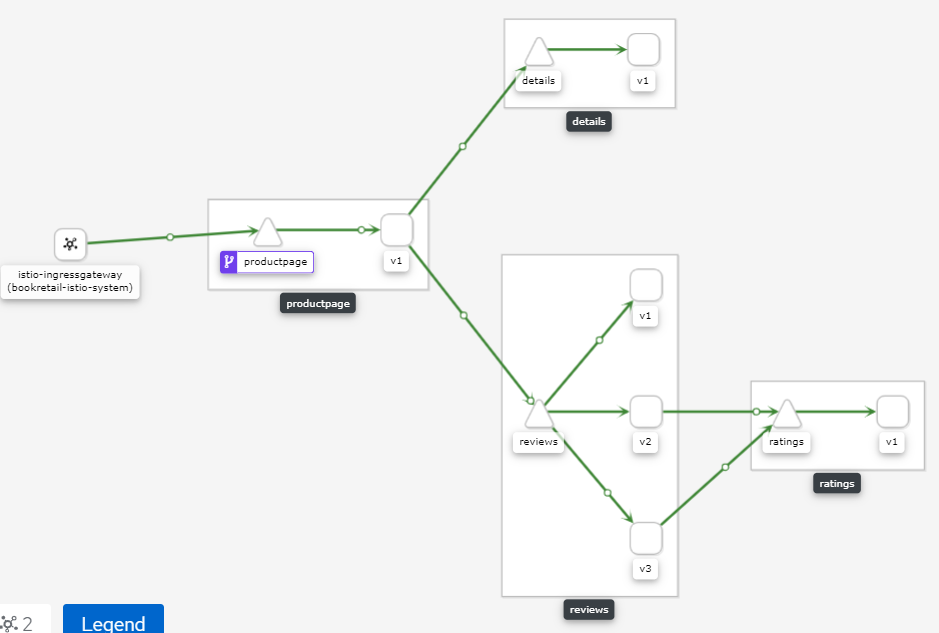

# Red Hat Service Mesh - Homework Assignment Lab

Red Hat Service Mesh Homework Assignment Lab for Adv Red Hat Service Mesh Course

* *Student*: Emilio Buchaillot
* *Company*: Semperti [Red Hat Partner]
* *Email*: <emilio.buchaillot@semperti.com>
* *Repo*: [Github - Openshift Adv Service Mesh Assignment - Emilio Buchaillot](https://github.com/emiliobucha/openshift-adv-service-mesh-lab)

## Evidence



## 2. POC Environment

*IMPORTANT!!! Expiration Lab 11/23/20 09:03 EST* 

* API Server

```
$ oc whoami --show-server
https://api.cluster-154a.154a.sandbox500.opentlc.com:6443
```

* Web Console

```
$ oc whoami --show-console
https://console-openshift-console.apps.cluster-154a.154a.sandbox500.opentlc.com
```

* Users

```
Admin User: admin
Admin Password: r3dh4t1!
```
```
Mesh Admin User: user1
Mesh Admin Password: r3dh4t1!
```

## 3. Bussiness Application and 4. OpenShift Service Mesh Operator

00. First at all, edit 00-set-env-var.sh file with your own environment variables

```
echo 'export LAB_MASTER_API=<lab_master_api>' >> $HOME/.bashrc
echo 'export OCP_USER=<ocp_user>' >> $HOME/.bashrc
echo 'export OCP_PASS=<ocp_password>' >> $HOME/.bashrc
echo 'export SM_CP_NS=bookretail-istio-system' >> $HOME/.bashrc
echo 'export BOOK_APP_NS=bookinfo' >> $HOME/.bashrc
echo 'export SUBDOMAIN_BASE=<subdomain_base>' >> $HOME/.bashrc
```

01. Execute 01-install-service-mesh-operator.sh script

This script installs all operators are needed for service mesh
    * ElasticSearch Operator
    * Kiali Operator
    * Jaeger Operator
    * Openshift Service Mesh Operator

    Note: to use the API v1 structure I had to create the subscription in channel 1.0 and create the control plane installation with apiVersion: maistra.io/v1

02. Execute 02-deploy-bookinfo-application.sh script

This script deploy bookinfo app 

03. Execute 03-deploy-control-plane.sh script

This script deploy servicemesh controlplane 

## 5. ServiceMeshMemberRoll

04. Execute 04-service-mesh-member-roll.sh script

This script creates the service mesh member roll and inject envoy proxy in all deployments

## 6. mTLS Security

05. Execute 05-apply-mTLS.sh script

    * This script creates certificate for istio-ingress
    * Create the gateway for productpage
    * Create all policies, destination rules and virtual services.

06. Execute 06-grant-permissions.sh

This script grant permissions to user1 in projects bookinfo and bookretail-istio-system

## 7. Testing
### Check functionality

```bash
export GATEWAY_URL=$(oc -n bookretail-istio-system get route productpage-gateway -o jsonpath='{.spec.host}')
curl -kv -o /dev/null -s -w "%{http_code}\n" https://$GATEWAY_URL/productpage
200
```

### Run continuous probes

```bash
while (true) ; do curl -kv -o /dev/null -s -w "%{http_code}\n" https://$GATEWAY_URL/productpage ; sleep .1 ; done
```

